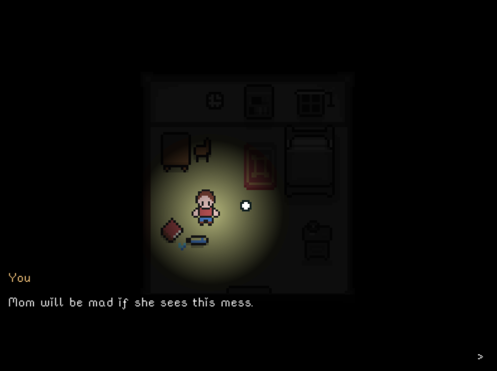
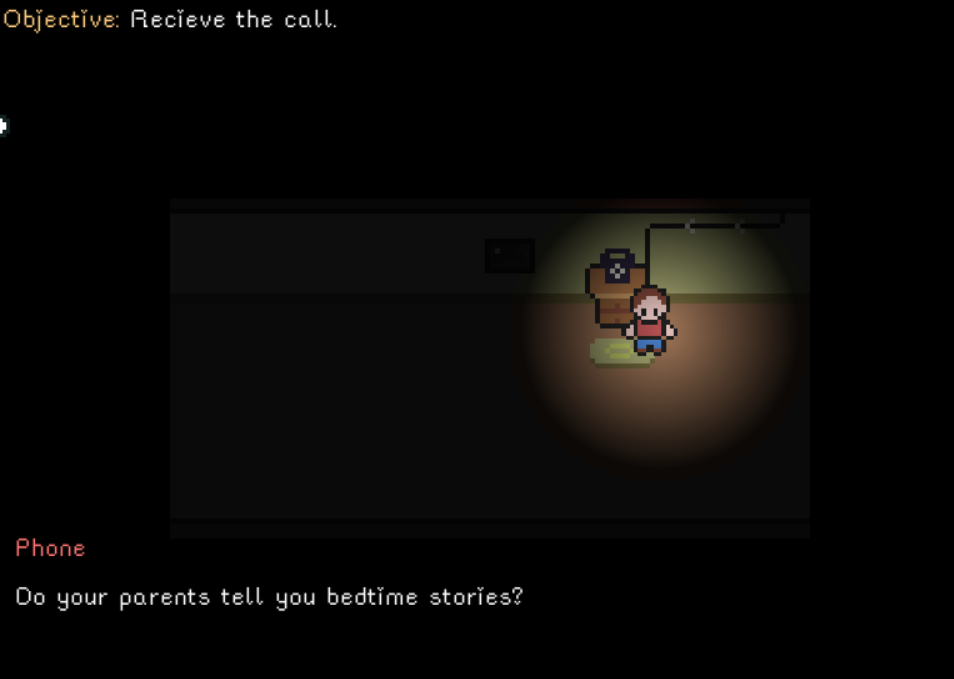

# Shriek.
Shriek is a topdown RPG Horror game written in Lua, using the Love2D game engine.
The story follows Tim, an 8-year old who has to spend a night alone in the house while
his parents are busy in a business meeting outside the city.

## Screenshots

## Running the game.
Distributions of the game aren't currently available as it's a work in progress, but you can
still run it by downloading the LOVE2D game engine.
Clone this repository into your local PC, then cd into it and run `love .`.

## Tools
The game is written mostly from scratch, in Lua.
**Love2D** is being used for rendering,asset loading etc, while the physics and 
entity management systems are hand written.

The pixel art for this game has been made with **aseprite**.

The sound is from some amazing artists over at [freesound](https://freesound.org) and 
[opengameart](https://opengameart.org).

All the exported art files are included in the `assets` directory of this repository.

## Development Status

Currently, I am adding more character animations and polishing the scene and inventory management systems. While we wait, you can check out some other games on my [itch profile](https://itch.io/profile/injuly).
